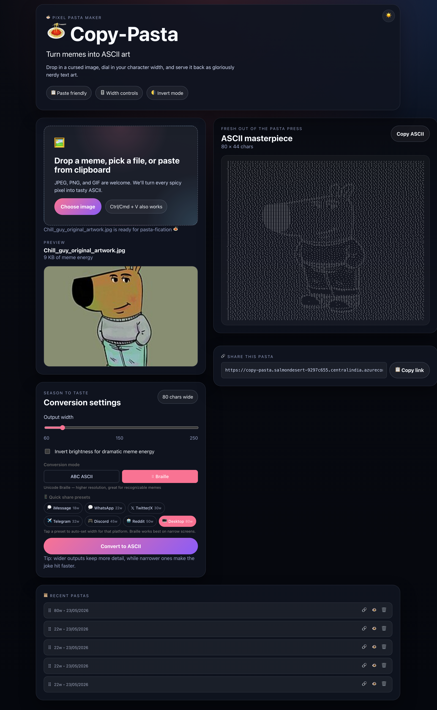
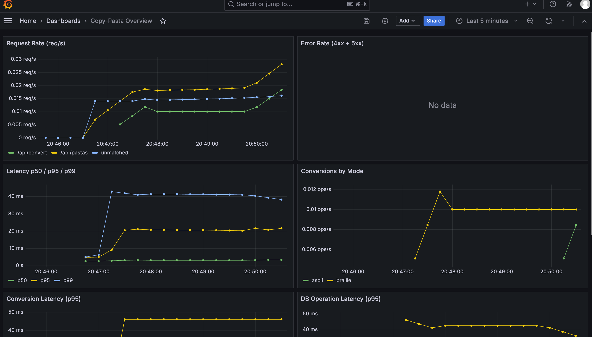
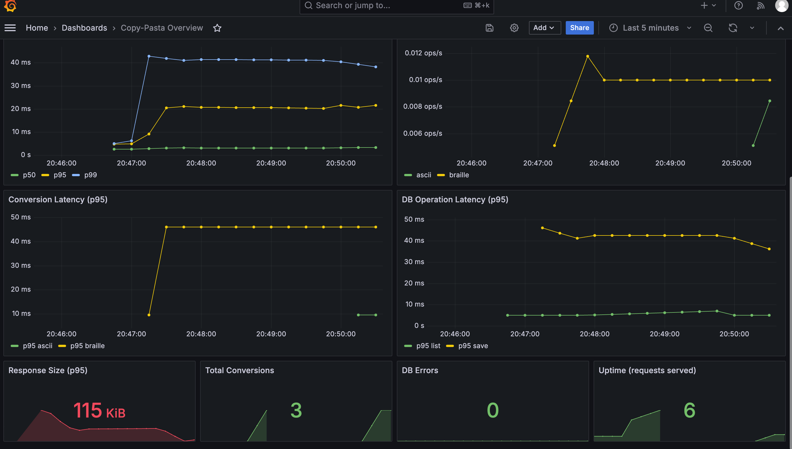

# 🍝 Copy-Pasta

> Turn memes into ASCII art — paste, convert, copy, share!

**Live**: https://copy-pasta.salmondesert-9297c655.centralindia.azurecontainerapps.io

A fun web app that converts meme images into ASCII art that you can copy-paste anywhere. Built with Go and React as a learning playground for backend development, frontend polish, and progressive productionization.

## 📸 Screenshots

### App in Action


### Grafana Observability Dashboard



## ✨ Features

- **Image to ASCII**: Upload, paste (Ctrl+V), or drag-and-drop any image (JPEG, PNG, GIF)
- **Braille Unicode mode**: High-resolution conversion using Unicode Braille characters (8 pixels per char)
- **Floyd-Steinberg dithering**: Simulates grayscale through dot density patterns
- **Edge detection**: Sobel operator preserves outlines at narrow widths
- **Persistence**: Conversions auto-saved to PostgreSQL with shareable links
- **Share page**: View any pasta via `/pasta/:id` — read-only, copyable
- **History panel**: Recent conversions with share link, view, and delete actions
- **Session-based ownership**: Anonymous cookie-based sessions, no login required
- **REST API**: Manage pastas (list, view, delete, publish) with auto-save on convert
- **Mobile share presets**: One-tap widths for WhatsApp, iMessage, Twitter, Telegram, Discord, Reddit
- **Dark/light theme**: Toggle with system preference detection and localStorage persistence
- **Configurable output**: Width slider, invert, A/B mode toggle (ASCII vs Braille)
- **One-click copy**: Copy your ASCII masterpiece to clipboard instantly
- **Graceful degradation**: App works without DB — persistence is best-effort

## 🏗️ Tech Stack

| Layer | Technology |
|-------|-----------|
| Backend | Go + Chi router |
| Frontend | React + TypeScript + Vite |
| Database | PostgreSQL (via pgx/v5 connection pool) |
| Infra | Azure Container Apps (prod), Docker Compose (local) |
| CI/CD | GitHub Actions (test on PR, deploy on merge to main) |
| ASCII Engine | Go `image` + `golang.org/x/image` |

## 🚀 Quick Start

### Prerequisites
- Go 1.25+
- Node.js 20+
- Docker & Docker Compose (optional)

### Local Development

```bash
# Run both services (requires make -j support)
make dev

# Or run individually:
make dev-backend   # Go server on :8080
make dev-frontend  # Vite dev server on :5173 (proxies /api to :8080)
```

### Docker

```bash
# Full stack with PostgreSQL (recommended for testing persistence)
docker compose up
# App: http://localhost:3000 (nginx proxies /api to backend internally)

# Single unified container (same as production, no DB)
docker build -t copy-pasta .
docker run -p 8080:8080 copy-pasta
# App: http://localhost:8080
```

### Observability

```bash
# Full stack + Prometheus + Grafana
make docker-up-obs
# App:        http://localhost:3000
# Prometheus: http://localhost:9090
# Grafana:    http://localhost:3001 (admin / $GF_SECURITY_ADMIN_PASSWORD, default: changeme)
```

Requires `EXPOSE_METRICS=true` in `.env`. Set `GF_SECURITY_ADMIN_PASSWORD` in `.env` to change the Grafana password. In production, `/metrics` is protected by bearer token auth (`METRICS_TOKEN` env var).

**Available metrics:**
| Metric | Type | Labels | Description |
|--------|------|--------|-------------|
| `http_requests_total` | Counter | method, route, status | Total HTTP requests |
| `http_request_duration_seconds` | Histogram | method, route | Request latency |
| `http_response_size_bytes` | Histogram | method, route | Response body size |
| `conversions_total` | Counter | mode | Image conversions count |
| `conversion_duration_seconds` | Histogram | mode | Conversion processing time |
| `db_operations_total` | Counter | operation, status | Database operation count |
| `db_operation_duration_seconds` | Histogram | operation | Database operation latency |

## 📁 Project Structure

```
Copy-Pasta/
├── backend/
│   ├── cmd/server/         # Entry point (serves API + static frontend)
│   └── internal/
│       ├── handler/        # HTTP handlers (convert, pastas management)
│       ├── converter/      # Image → ASCII/Braille engine
│       ├── middleware/     # CORS, rate limiting, logging, metrics, session cookies
│       └── store/          # PostgreSQL persistence (pgx/v5)
├── frontend/
│   ├── src/
│   │   ├── components/     # React components (ImageUploader, AsciiOutput, HistoryPanel, PastaView, ThemeToggle)
│   │   ├── api/            # API clients (convert, pastas)
│   │   └── App.tsx         # Main app with controls, presets, mode toggle
│   └── index.html
├── infra/
│   └── setup-azure.sh     # Azure infrastructure provisioning (idempotent)
├── .github/workflows/
│   └── deploy.yml          # CI/CD: test → build → deploy
├── docs/
│   ├── PLAN.md             # Phase-by-phase roadmap
│   ├── IMPLEMENTATION.md   # Architecture & API reference
│   └── DEPLOYMENT.md       # Azure deployment guide
├── Dockerfile              # Multi-stage: Node build → Go build → Alpine runtime
├── docker-compose.yml      # Full stack: Go + React + PostgreSQL
├── .env.example            # Local env var template
├── Makefile
├── CONTRIBUTING.md         # Branch/PR workflow rules
└── README.md
```

## 🗺️ Roadmap

- [x] **Phase 1**: Foundation — end-to-end image → ASCII flow
- [x] **Phase 2**: Polish — paste, drag-drop, braille mode, dithering, presets, dark/light theme
- [x] **Phase 2.5**: Deploy — Azure Container Apps, CI/CD, GitHub Actions
- [x] **Phase 3**: Persistence — PostgreSQL, session cookies, shareable URLs, history panel, share page
- [x] **Phase 4a-c**: Observability — structured logging, Prometheus metrics, rate limiting
- [ ] **Phase 4d**: Distributed tracing (OpenTelemetry, Jaeger/Tempo)
- [ ] **Phase 5**: Social — public gallery, OG meta share cards, likes, leaderboard
- [ ] **Phase 6**: Production hardening — graceful shutdown, migrations, CDN, alerting

See **[docs/PLAN.md](docs/PLAN.md)** for detailed task tracking.

## 📚 Documentation

- **[Project Plan](docs/PLAN.md)** — Phase-by-phase roadmap with task tracking
- **[Testing Plan](docs/TESTING.md)** — Testing strategy, test cases, implementation order
- **[Implementation Guide](docs/IMPLEMENTATION.md)** — Architecture, API reference, design decisions
- **[Deployment Guide](docs/DEPLOYMENT.md)** — Azure setup, CI/CD, monitoring
- **[Contributing](CONTRIBUTING.md)** — Branch strategy, PR workflow, commit conventions

## 📝 License

MIT
